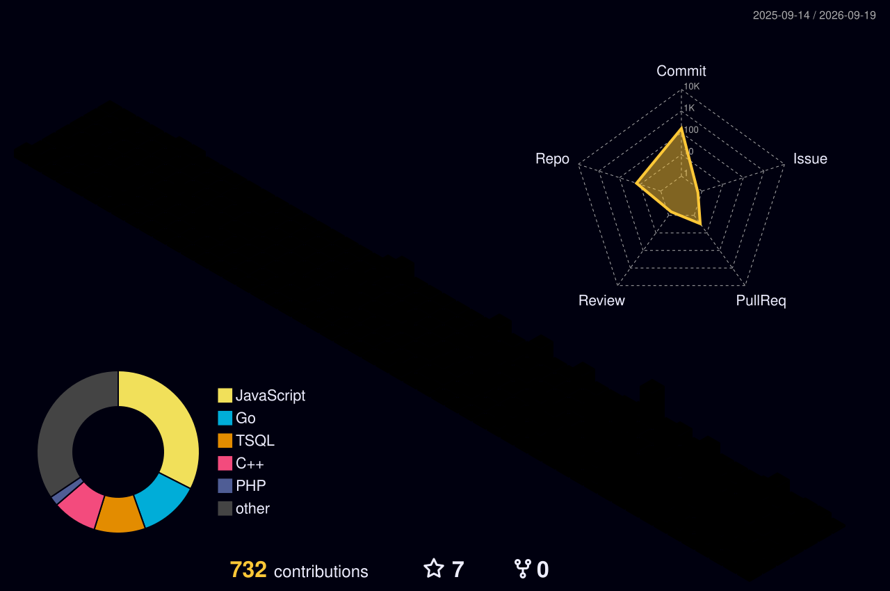

<!-- ===================== HEADER BANNER ===================== -->

<!-- ===================== TYPING ANIMATION ===================== -->

 

<!-- ===================== ABOUT ME ===================== -->
## 👨‍💻 About Me

I'm a backend and systems engineer. Most of what I build sits below the UI: rate limiters, write-ahead logs, job queues, flight scrapers. Lately I've been learning distributed systems with Go and reading *Designing Data-Intensive Applications*. I'm in my 3rd year of CS at KJ Somaiya, Mumbai, graduating in 2028.

- 🔭 Currently building **Limitd**, a distributed rate limiter in Go
- 🌱 Going deep on **distributed systems, storage internals, and Go concurrency**
- 📖 Reading **DDIA** and turning chapters into small implementations
- 💬 Ask me about **rate limiting, WALs, Redis/Lua, or Node.js job queues**

 

<!-- ===================== CURRENTLY BUILDING ===================== -->
## 🛠️ Currently Building

**[`Limitd`](https://github.com/ArnavSaroj/Limitd)** — a distributed rate limiter in Go. Token-bucket algorithm backed by atomic Redis + Lua scripts, with an in-memory fallback when Redis is down, Docker packaging, and a `/metrics` endpoint.

**[`WAL`](https://github.com/ArnavSaroj/WAL-write-ahead-log)** — a Write-Ahead Log in C++. Binary log format, CRC32 integrity checks, and LSN-based crash recovery.

A few other things I've built: **Skymate**, a distributed flight scraper on Node.js, BullMQ, Redis and PostgreSQL; a **SQL Data Warehouse** using medallion architecture and T-SQL ETL pipelines; and a **Quad Tree image compressor** .

 

<!-- ===================== TECH STACK ===================== -->
## 🧰 Tech Stack

**Languages**

**Backend**

**Databases**

**Tools**

 

<!-- ===================== GITHUB ANALYTICS ===================== -->
## 📊 GitHub Analytics

<table>
<tr>
<td>

</td>
<td>

</td>
</tr>
</table>

<!-- ===================== 3D CONTRIBUTION CALENDAR ===================== -->
## 🧊 Contribution Landscape

<!-- Generated by the 3D-contrib workflow (see .github/workflows/profile-3d.yml) -->

 

<!-- ===================== ACTIVITY GRAPH ===================== -->
## 📈 Contribution Activity

 

<!-- ===================== SOCIALS ===================== -->
## 🌐 Connect

 

<!-- ===================== VISITOR COUNTER ===================== -->

<!-- ===================== FOOTER BANNER ===================== -->

